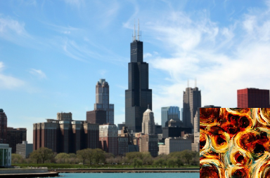
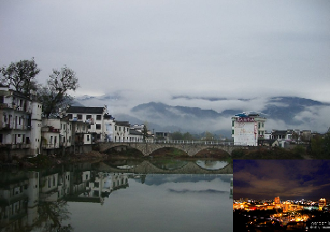
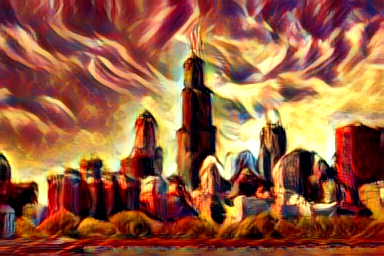
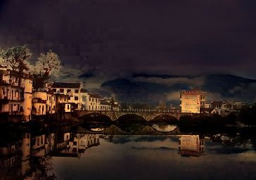

## Learning Linear Transformations for Fast Image and Video Style Transfer
**[[Paper]](http://openaccess.thecvf.com/content_CVPR_2019/papers/Li_Learning_Linear_Transformations_for_Fast_Image_and_Video_Style_Transfer_CVPR_2019_paper.pdf)** **[[Project Page]](https://sites.google.com/view/linear-style-transfer-cvpr19/)**




## Prerequisites
- [Pytorch](http://pytorch.org/)
- [torchvision](https://github.com/pytorch/vision)
- [opencv](https://opencv.org/) for video generation

**All code tested on Ubuntu 16.04, pytorch 0.4.1, and opencv 3.4.2**

## Style Transfer
- Clone from github: `git clone https://github.com/sunshineatnoon/LinearStyleTransfer`
- Download pre-trained models from [google drive](https://drive.google.com/file/d/1H9T5rfXGlGCUh04DGkpkMFbVnmscJAbs/view?usp=sharing).
- Uncompress to root folder :
```
cd LinearStyleTransfer
unzip models.zip
rm models.zip
```

#### Artistic style transfer
```
python TestArtistic.py
```
or conduct style transfer on relu_31 features
```
python TestArtistic.py --vgg_dir models/vgg_r31.pth --decoder_dir models/dec_r31.pth --matrixPath models/r31.pth --layer r31
```

#### Photo-realistic style transfer
For photo-realistic style transfer, we need first compile the [pytorch_spn](https://github.com/Liusifei/pytorch_spn) repository.
```
cd libs/pytorch_spn
sh make.sh
cd ../..
```
Then:
```
python TestPhotoReal.py
```
Note: images with `_filtered.png` as postfix are images filtered by the SPN after style transfer, images with `_smooth.png` as postfix are images post process by a [smooth filter](https://github.com/LouieYang/deep-photo-styletransfer-tf/blob/master/smooth_local_affine.py).

#### Video style transfer
```
python TestVideo.py
```

#### Real-time video demo
```
python real-time-demo.py --vgg_dir models/vgg_r31.pth --decoder_dir models/dec_r31.pth --matrixPath models/r31.pth --layer r31
```

## Model Training
### Data Preparation
- MSCOCO
```
wget http://msvocds.blob.core.windows.net/coco2014/train2014.zip
```
- WikiArt
  - Either manually download from [kaggle](https://www.kaggle.com/c/painter-by-numbers).
  - Or install [kaggle-cli](https://github.com/floydwch/kaggle-cli) and download by running:
  ```
  kg download -u <username> -p <password> -c painter-by-numbers -f train.zip
  ```

### Training
#### Train a style transfer model
To train a model that transfers relu4_1 features, run:
```
python Train.py --vgg_dir models/vgg_r41.pth --decoder_dir models/dec_r41.pth --layer r41 --contentPath PATH_TO_MSCOCO --stylePath PATH_TO_WikiArt --outf OUTPUT_DIR
```
or train a model that transfers relu3_1 features:
```
python Train.py --vgg_dir models/vgg_r31.pth --decoder_dir models/dec_r31.pth --layer r31 --contentPath PATH_TO_MSCOCO --stylePath PATH_TO_WikiArt --outf OUTPUT_DIR
```
Key hyper-parameters:
- style_layers: which features to compute style loss.
- style_weight: larger style weight leads to heavier style in transferred images.

Intermediate results and weight will be stored in `OUTPUT_DIR`

#### Train a SPN model to cancel distortions for photo-realistic style transfer
Run:
```
python TrainSPN.py --contentPath PATH_TO_MSCOCO
```

### Acknowledgement
- We use the [smooth filter](https://github.com/LouieYang/deep-photo-styletransfer-tf/blob/master/smooth_local_affine.py) by [LouieYang](https://github.com/LouieYang) in the photo-realistic style transfer.

### Citation
```
@inproceedings{li2018learning,
    author = {Li, Xueting and Liu, Sifei and Kautz, Jan and Yang, Ming-Hsuan},
    title = {Learning Linear Transformations for Fast Arbitrary Style Transfer},
    booktitle = {IEEE Conference on Computer Vision and Pattern Recognition},
    year = {2019}
}
```
